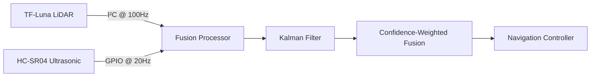

# Sensor Fusion Guide: LiDAR + Ultrasonic Integration

This document explains the sensor fusion methodology for combining TF-Luna LiDAR and HC-SR04 ultrasonic data in our autonomous vehicle.

## Fusion Architecture Overview


## Key Parameters

| Sensor          | Range       | Precision | Update Rate | Best Use Case       |
|-----------------|-------------|-----------|-------------|---------------------|
| TF-Luna LiDAR   | 0.1m - 8.0m | ±3cm      | 100Hz       | Long-range mapping  |
| HC-SR04         | 0.02m - 4m  | ±0.5cm    | 20Hz        | Close-range safety |

## Fusion Algorithm

### Step 1: Coordinate Transformation
```cpp
// Transform LiDAR point cloud to vehicle coordinates
void transformLidarData() {
    for (int i = 0; i < lidar_points; i++) {
        float angle = lidar.getAngle(i);
        float distance = lidar.getDistance(i);
        x[i] = distance * cos(angle - LIDAR_MOUNT_OFFSET);
        y[i] = distance * sin(angle - LIDAR_MOUNT_OFFSET);
    }
}
```

### Step 2: Kalman Filtering
Each sensor gets its own Kalman filter to reduce noise:
```python
# Pseudocode for ultrasonic Kalman filter
Q = 0.01  # Process noise
R = 0.1   # Sensor noise

def kalman_update(z, prev_estimate, uncertainty):
    # Prediction
    pred_estimate = prev_estimate
    pred_uncertainty = uncertainty + Q
    
    # Update
    kalman_gain = pred_uncertainty / (pred_uncertainty + R)
    new_estimate = pred_estimate + kalman_gain * (z - pred_estimate)
    new_uncertainty = (1 - kalman_gain) * pred_uncertainty
    
    return new_estimate, new_uncertainty
```

### Step 3: Confidence-Weighted Fusion
```cpp
// Fuse sensor readings based on confidence
float fusedDistance() {
    float lidar_dist = getFilteredLidar();
    float us_dist = getFilteredUltrasonic();
    
    // Weighting factors (tunable)
    float lidar_confidence = 0.7 * (1 - exp(-0.5 * lidar_dist));
    float us_confidence = 0.9 * exp(-0.1 * us_dist);
    
    // Normalize
    float total = lidar_confidence + us_confidence;
    
    return (lidar_confidence * lidar_dist + us_confidence * us_dist) / total;
}
```

## Calibration Procedure
1. **Static Calibration**:
   ```bash
   Place target at known distances (0.5m, 1m, 2m, 4m)
   Run calibration.ino to record sensor error
   Update src/sensor_calibration.h with offset values
   ```

2. **Dynamic Calibration**:
   ```python
   while moving:
       if ultrasonic_change > threshold and lidar_change < threshold:
           adjust_ultrasonic_gain(0.95)
       elif lidar_change > threshold and ultrasonic_change < threshold:
           adjust_lidar_gain(1.05)
   ```

## Troubleshooting Table

| Symptom                      | Likely Cause               | Solution                     |
|------------------------------|----------------------------|------------------------------|
| False emergency stops        | Ultrasonic multipath       | Add foam ring around sensor  |
| LiDAR dropout in sunlight    | IR interference            | Use sun shield enclosure     |
| Inconsistent fusion output   | Time synchronization       | Add hardware interrupt sync  |
| Sensor conflict > 1m         | Calibration drift          | Re-run static calibration    |

> **Pro Tip**: Always validate sensor readings in the Serial Plotter before autonomous operation!

[Next: ROS Integration](ROS_Integration.md)
