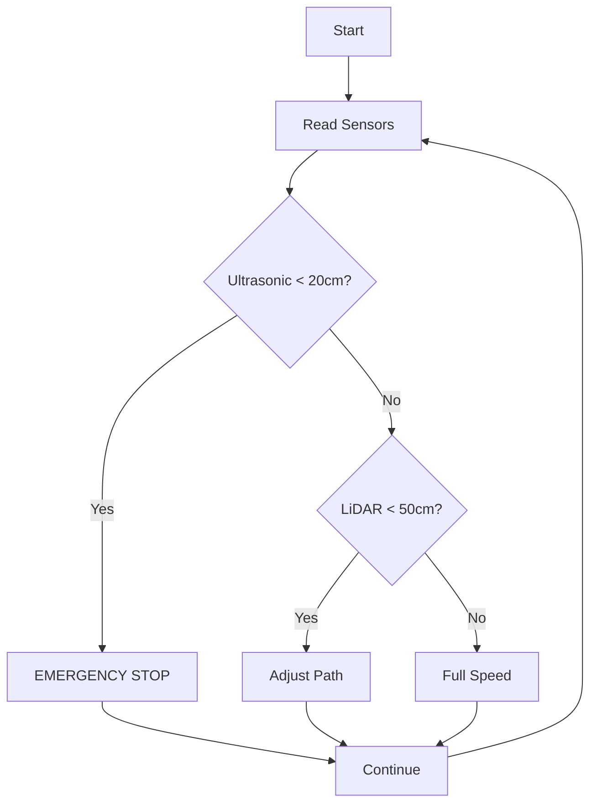

# DIY LiDAR Self-Driving Car

**An open-source autonomous vehicle platform** featuring sensor fusion (LiDAR + Ultrasonic), real-time navigation, and collision avoidance - all powered by ESP32!

## Key Features

- **Hybrid Sensor Fusion**: Combines TF-Luna LiDAR (8m range) with ultrasonic sensors for redundant obstacle detection
- **Real-Time Navigation**: FreeRTOS-powered ESP32 processes sensor data at 100Hz
- **Collision Avoidance**: Emergency braking system triggered at 20cm proximity
- **ROS 2 Ready**: Migration path for advanced navigation with Nav2
- **Open Hardware**: 3D printable parts and accessible components under $100

## Hardware Setup

### Bill of Materials
| Component | Quantity | Source |
|-----------|----------|--------|
| [ESP32 Dev Board](https://www.aliexpress.com/item/1005005233434681.html) | 1 | AliExpress |
| [TF-Luna LiDAR](https://www.sparkfun.com/products/17786) | 1 | SparkFun |
| [HC-SR04 Ultrasonic Sensors](https://www.adafruit.com/product/3942) | 3 | Adafruit |
| [L298N Motor Driver](https://www.amazon.com/HiLetgo-L298N-Driver-Stepper-Controller/dp/B014KMHSW6) | 1 | Amazon |
| [TT Gear Motors](https://www.dfrobot.com/product-244.html) | 2 | DFRobot |
| [18650 Batteries](https://18650batterystore.com/products/samsung-35e) | 2 | 18650BatteryStore |

> Full BOM with links: [Hardware/Bill_of_Materials.md](Hardware/Bill_of_Materials.md)

## Getting Started

### Prerequisites
- PlatformIO (VSCode extension)
- Arduino IDE (for initial flashing)
- 3D printer (for custom parts)

### Installation
```bash
# Clone repository
git clone https://github.com/Rasrizkov/DIY-LiDAR-Car.git
cd DIY-LiDAR-Car

# Install dependencies
pio pkg install

# Build and upload to ESP32
pio run -t upload

# Monitor serial output
pio device monitor
```

### First-Time Calibration
```python
# Run calibration script
python3 scripts/sensor_calibration.py

# Follow on-screen instructions
Place calibration target at 50cm distance
Press ENTER to record measurement...
```

## 🤖 Autonomous Logic
Our decision-making system prioritizes safety while enabling efficient navigation:



> Detailed flowchart: [Documentation/Autonomous_Logic_Flowchart.png](Documentation/Autonomous_Logic_Flowchart.png)

## Build Instructions

### Step 1: Mechanical Assembly
1. Print 3D models
2. Mount motors and wheels to chassis
3. Install LiDAR at 15cm height with 30° forward tilt
4. Position ultrasonic sensors: front (0°), left (+45°), right (-45°)

### Step 2: Electronics
```bash
# Typical connections:
LiDAR SDA → ESP32 GPIO21
LiDAR SCL → ESP32 GPIO22
Ultrasonic TRIG → ESP32 GPIO16
Ultrasonic ECHO → ESP32 GPIO17
Motor ENA → ESP32 GPIO25
```

### Step 3: Firmware Setup
1. Install PlatformIO in VSCode
2. Open `Firmware/PlatformIO_Project` folder
3. Configure `platformio.ini` for your ESP32 variant
4. Flash using PlatformIO task runner

## Troubleshooting
| Symptom | Solution |
|---------|----------|
| LiDAR not detected | Check I²C address (default 0x10), ensure 5V power |
| False ultrasonic readings | Add foam ring around sensor, avoid reflective surfaces |
| Motor jitter | Add 100µF capacitor across motor terminals |
| ESP32 overheating | Enable deep sleep between navigation cycles |

## Future Upgrades
- [ ] ROS 2 integration ([see roadmap](Documentation/ROS_Integration.md))
- [ ] IMU-based dead reckoning
- [ ] Camera integration for object recognition
- [ ] Swarm coordination protocol

## Contributing
We welcome contributions! Please follow these steps:
1. Fork the repository
2. Create your feature branch (`git checkout -b feature/amazing-feature`)
3. Commit your changes (`git commit -m 'Add some amazing feature'`)
4. Push to the branch (`git push origin feature/amazing-feature`)
5. Open a pull request

## License
Distributed under the MIT License. See `LICENSE` for more information.
